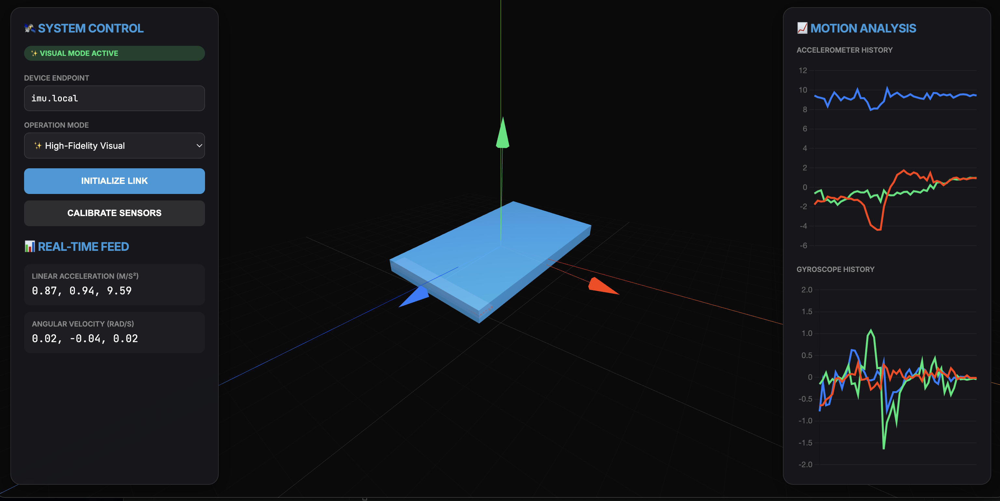

# MPU6050 + ESP32-C3 Visualization Tool

## 1. Project Overview
A standalone, web-based experimentation platform for the MPU6050 IMU using an ESP32-C3. This tool allows for real-time monitoring and visualization of motion data over a local network, featuring 50Hz telemetry and a high-performance 3D dashboard.

## 2. Hardware Setup
- **Microcontroller:** ESP32-C3
- **Sensor:** MPU6050 (Accel + Gyro)
- **Wiring (I2C):**
    - **SDA:** GPIO 8
    - **SCL:** GPIO 9
    - **VCC:** 3.3V
    - **GND:** GND

## 3. Getting Started

### Firmware (ESP32-C3)
1. Navigate to the `firmware/` directory.
2. Update `include/wifi_config.h` with your credentials (or use AP mode).
3. Run `pio run -t upload` to flash the ESP32.
4. Open Serial Monitor at 115200 baud to verify the IP address.

### Web Dashboard
1. Open `dashboard/index.html` in a modern web browser.
2. **Visual Mode:** Use for full graph analysis and 3D smoothing.
3. **Robot Mode:** Use for zero-latency 1:1 orientation tracking.
4. Set the **Device Endpoint** to your ESP32 IP (Default AP: `192.168.4.1`).

## 4. Key Achievements (Test Phase)
- **50Hz Real-Time Stream**: Optimized WebSocket throughput for zero-perceivable lag.
- **Full 3-Axis Orientation**: Integrated gravity-based Pitch/Roll with Gyro-integrated Yaw.
- **Stability Filtering**: Implemented Alpha-filter ($\alpha=0.8$) on-chip to suppress MPU6050 silicon jitter.
- **Shortest-Path Logic**: Resolved the 180° "flip" bug using angular distance interpolation.

## 5. Future Robot Integration
The verified math and filtering logic from this sandbox are ready to be migrated to the `autoJetsonBot` main navigation stack via the ESP32-S3 serial bridge.
