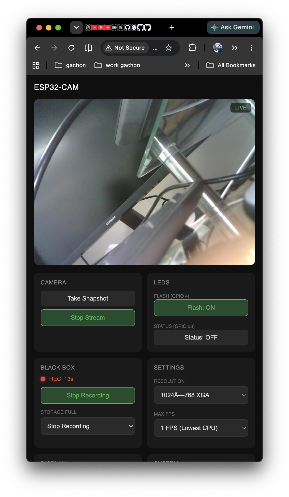
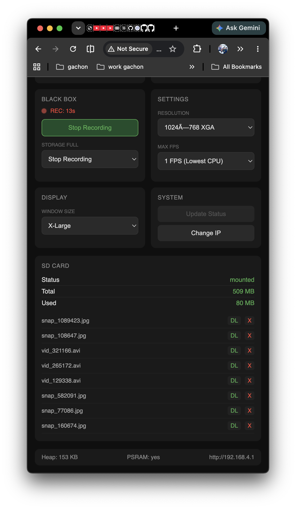

# ESP32-CAM Smart Stream & Black Box

A modular, high-performance ESP32-CAM firmware featuring MJPEG streaming, an integrated web dashboard, and a fully automated "Black Box" video recording system.

---

## 🚀 Key Features

- **Embedded Dashboard:** Zero external dependencies. The full UI is served directly from the ESP32.
- **Modular UI Development:** Separate HTML, CSS, and JS files for professional-grade web development.
- **MJPEG Streaming:** Optimized live video with real-time FPS and resolution controls.
- **Black Box Recording:** Background AVI video recording directly to the SD card.
- **Circular Storage Management:** Automatically overwrites oldest footage when the SD card is full.
- **NTP Time Sync:** Synchronizes with global time servers for timestamped video filenames.
- **Dual LED Control:** Independent control for the **Flash LED** (Front) and **Status LED** (Back).
- **Web File Manager:** Browse, download, and delete your recordings/snapshots via the browser.
- **Advanced Stability:** Optimized server tasks, increased memory stack, and expanded URI handlers for robust multi-device performance.

---

## 📸 Showcase

<p align="center">
  
  
</p>

---

## 🛠 Hardware Specifications

| Component | Detail |
|---|---|
| **Board** | AI-Thinker ESP32-CAM |
| **Programmer** | ESP32-CAM-MB (USB-to-Serial) |
| **Flash LED** | GPIO 4 (Active HIGH) — *Note: Shared with SD Card* |
| **Status LED** | GPIO 33 (Active LOW) — *Note: Located on the back* |
| **Camera** | OV2640 2MP |
| **Power** | 5V via Micro-USB (1A supply recommended) |

---

## 💻 Software & Development

### 1. Initial Setup
1.  **Clone the Repository.**
2.  **Configure Credentials:**
    Copy `firmware/include/config.example.h` to `firmware/include/config.h` and enter your Wi-Fi details.
3.  **Flash the Firmware:**
    Use **PlatformIO** in VSCode to upload the code to your board.

### 2. Modular UI Workflow (For Developers)
The dashboard UI is no longer a messy C++ string. It is developed using standard web files in the `/dashboard` folder.

- **`dashboard/index.html`**: HTML structure.
- **`dashboard/css/style.css`**: UI styling.
- **`dashboard/js/script.js`**: Frontend logic.

**How to sync changes to the ESP32:**
After editing any file in the `dashboard/` folder, run:
```bash
python3 dashboard/generate_header.py
```
This script "packs" the web files into `firmware/src/server/index_html.h`. Then, simply re-flash your board.

---

## 🌐 Accessing the System

### Direct Access
1. Connect your device to the same Wi-Fi as the ESP32 (or connect to its hotspot: `ESP32-CAM`).
2. Open your browser and go to: `http://<esp32-ip>/`
    - *Default AP IP: `http://192.168.4.1/`*

### Local Development Server
To preview UI changes instantly on your Mac without flashing:
```bash
cd dashboard
./lunchweb.sh
```
Open `http://localhost:8080` and use the **Change IP** button to point it to your board.

---

## 🎥 System Controls

### Recording (Black Box)
- **Automatic Naming:** Files are saved as `vid_YYYYMMDD_HHMMSS.avi`.
- **Policy:** Select `Overwrite Oldest` to ensure your "Black Box" never stops recording, even when the SD card is full.
- **Stability:** For 24/7 recording, it is recommended to use **QVGA** resolution at **10 FPS**.

### Performance Optimization
If the dashboard feels slow or the LED buttons don't respond immediately:
1.  **Stop the Stream:** Click **Stop Stream** to free up 90% of the CPU.
2.  **Lower FPS:** Set **Max FPS** to `5` or `10`. This is the best way to ensure the board stays responsive during multi-device use.

---

## 📂 Project Architecture

```
my-esp32-cam/
├── dashboard/           # UI Source Files
│   ├── css/ style.css   # Styles
│   ├── js/ script.js    # Frontend Logic
│   ├── index.html       # UI Structure
│   └── generate_header.py # Syncs UI to C++
└── firmware/            # ESP32 Source Code
    ├── include/         # Configs
    └── src/
        ├── camera/      # OV2640 Drivers
        ├── network/     # Wi-Fi & NTP Sync
        ├── server/      # Web Server & UI Header
        └── main.cpp     # System Orchestration
```

---

## ⚠️ Known Hardware Limits
- **GPIO 4 Conflict:** The bright Flash LED shares a pin with the SD card. It will flicker while the SD card is being written to (Recording/Snapshots).
- **Single Core:** The ESP32-CAM is a single-core module. Processing heavy video and web requests simultaneously can lead to lag if the FPS is set too high.
